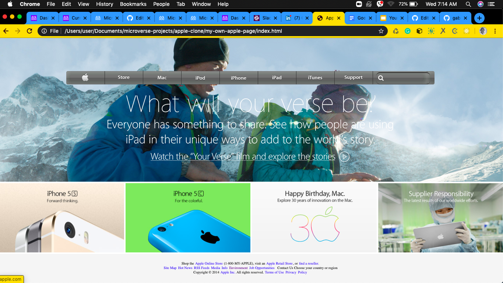

# APPLE HOME PAGE

> A realistic clone of Apple.com homepage

A very realistic clone of Apple.com home page with well placed background images and a conspicuous navigation bar.

## Built With

- HTML,
- CSS,
- W3 CSS

## Live Demo

[Live Demo Link](https://adoring-babbage-94226c.netlify.com)

# Getting Started
To use it locally, you need to :
1. Fork the repository to your GitHub account.
2. Choose a local folder for the cloned files.
3. Clone the repository to your local machine.
4. Double click on 'index.html'.

# Author

**Gabrie Lhilarion**

* Github: **[@gabrie-lhilarion](https://github.com/gabrie-lhilarion)**
* Twitter: **[@gabrielDeman](https://www.twitter.com/gabrielDeman)**
* Linkedin: **[linkedin](https://www.linkedin.com/in/gabrielhilarion/)**
